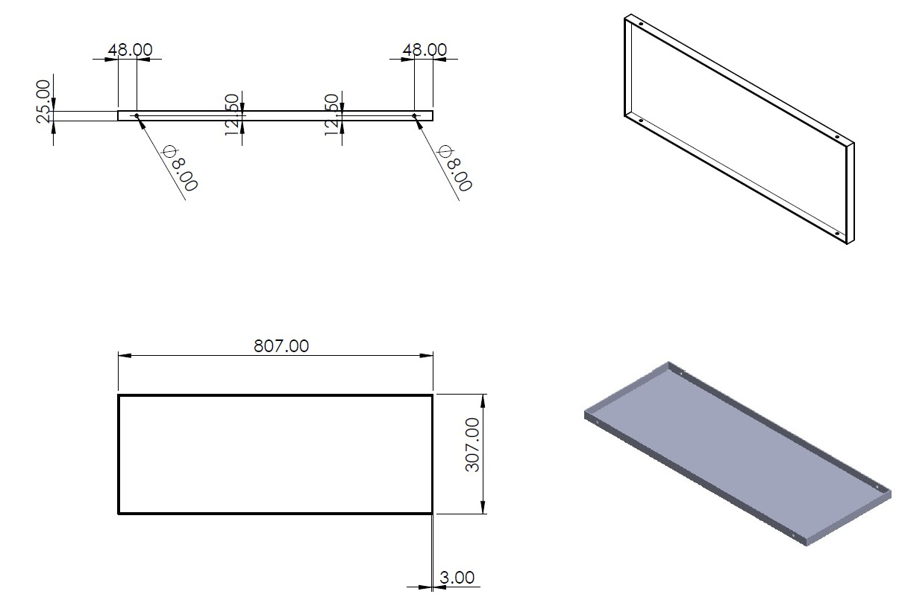
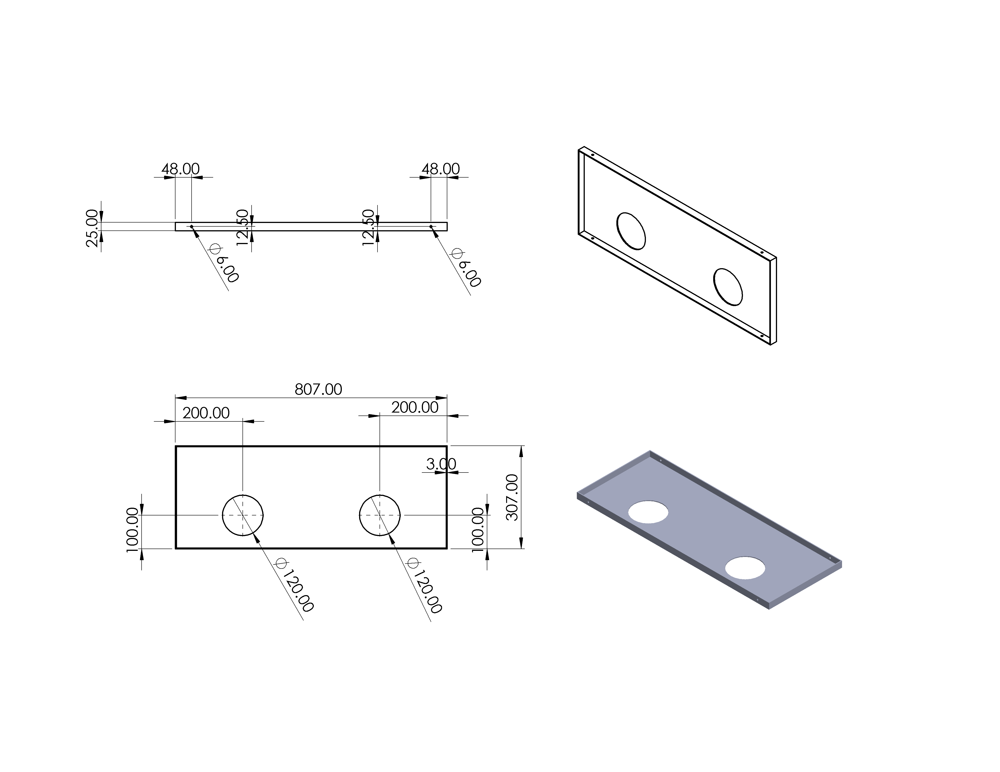
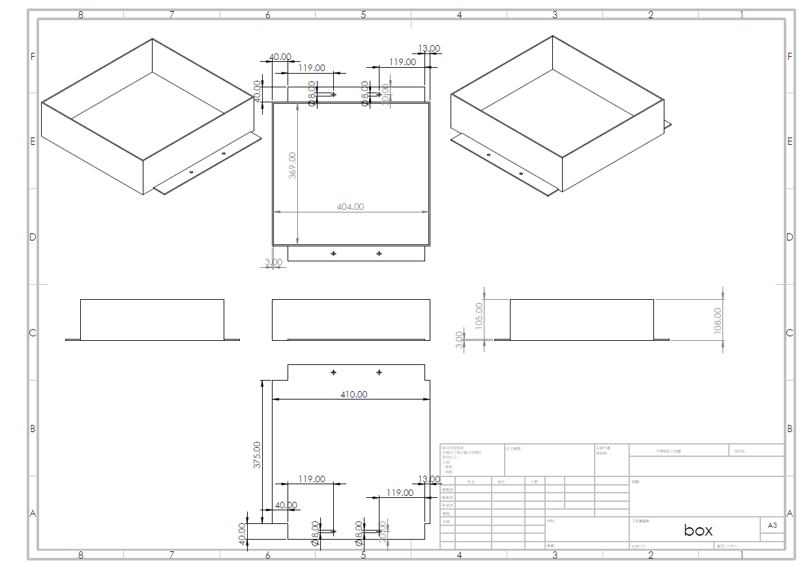
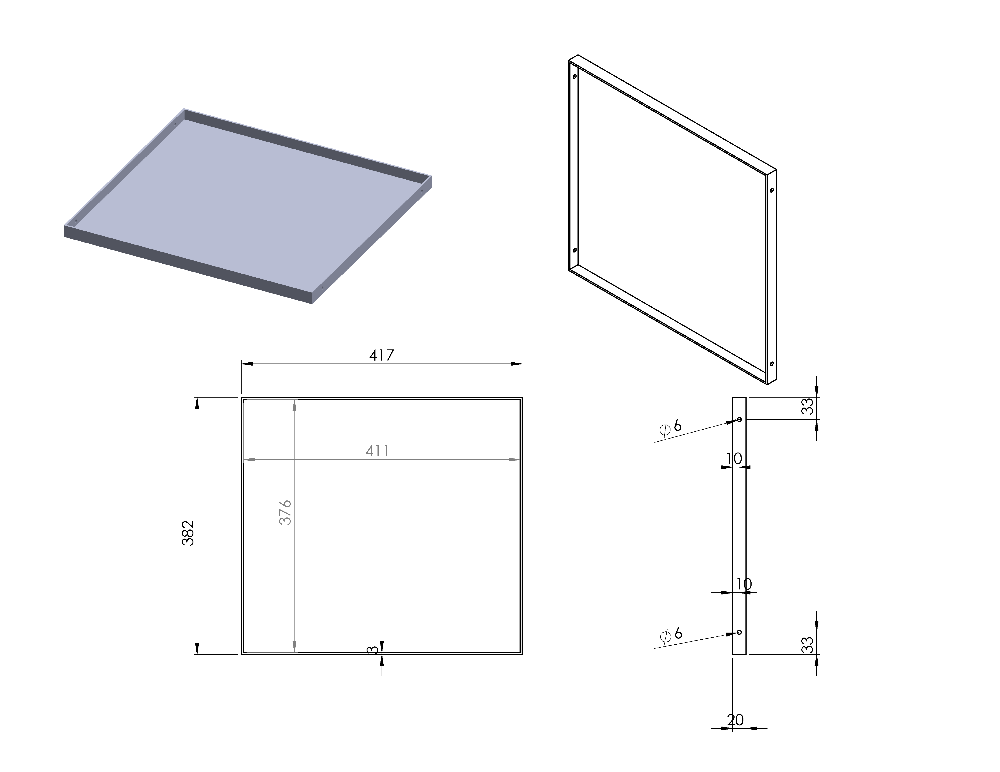

SPIE-CAD
===
檔案說明
---
- `img`資料夾用來放圖片
- `pdf`資料夾用來放工程圖pdf檔
- `SLDDRW`為SolidWorks工程圖原始檔
- `SLDPRT`為SolidWorks CAD Files

汽車平台
---
`car_box_lid` : 從`car_box_lid_with_2_holes`修改，移除兩個風扇孔，鎖孔 φ 6改至 φ 8

`car_box_lid_with_2_holes` : 皆為包含厚度的尺寸

舊車平台
---
`golf_car_box` : 兩側翅膀上的鎖孔位置將翅膀分成三等份

`golf_car_box_lid` : 皆為包含厚度的尺寸
